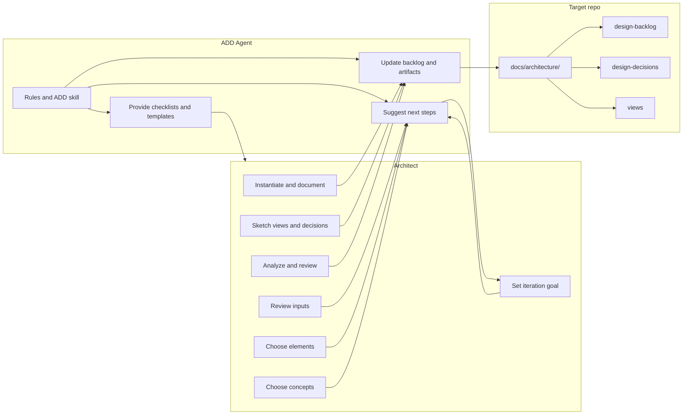

# ADD Solution Architect Agent — требования и план

## 1. Роль и границы

- **Вы**: Solution Architect, все решения принимаете вы.
- **Agent**: помощник, который ведёт по процессу ADD 3.0, предлагает следующие шаги, собирает информацию и поддерживает артефакты в актуальном состоянии.
- **Система создания**: конфигурация в `.cursor/`** (правила, скиллы, при необходимости AGENTS.md).
- **Целевая система**: репозиторий в корне (любой проект, над которым вы работаете с Agent). Артефакты ADD хранятся в `docs/architecture/` этого репозитория.
- **Язык**: взаимодействие с Agent — русский; имена файлов, шаблоны, теги в артефактах — английский.

### 1.1 Требования к системе создания (.cursor) и интерактивности

- **Описание артефактов Agent** (правила, скилл, AGENTS.md): только на **русском**, формулировки **максимально лаконичные**.
- **Шаблоны артефактов целевой системы**: **строгие** — фиксированная структура, обязательные поля/разделы, без вольной формы.
- **Работа с Agent**: **очень интерактивная** — на каждом шаге ADD и при любом действии Agent задаёт **вопрос с 3–5 вариантами ответа**; пользователь выбирает вариант, Agent действует по выбору и снова предлагает варианты.

---

## 2. Требования к функциональности Agent

### 2.1 Следование процессу ADD 3.0 (7 шагов)

Agent должен знать шаги и на каждом этапе:

- напоминать цель шага и входы/выходы по книге;
- предлагать конкретные следующие действия;
- не принимать решения за архитектора — только предлагать варианты и формулировки.


| Шаг                                   | Действие Agent                                                                                                                                                                          |
| ------------------------------------- | --------------------------------------------------------------------------------------------------------------------------------------------------------------------------------------- |
| **1. Review Inputs**                  | Проверить наличие: design purpose, primary functionality, QA scenarios, constraints, concerns; для brownfield — существующая архитектура. Предложить чек-лист и шаблоны для заполнения. |
| **2. Establish iteration goal**       | Предложить выбор драйверов из бэклога (Not Yet Addressed), проверить "right-sized" цель (один важный / семейство сходных / связанные драйверы).                                         |
| **3. Choose elements to refine**      | Для greenfield — система/контекст; для brownfield — элементы из as-built. Предложить связь выбранных элементов с целью итерации.                                                        |
| **4. Choose design concepts**         | Напомнить типы (reference architectures, patterns, tactics, externally developed components), предложить варианты по контексту (mature/novel/brownfield) без выбора за пользователя.    |
| **5. Instantiate, allocate, define**  | Помочь зафиксировать элементы, ответственности, интерфейсы; предложить структуру таблицы ответственностей и интерфейсов.                                                                |
| **6. Sketch views, record decisions** | Предложить/обновить эскизы (Mermaid), таблицу решений с rationale; сценарийная документация (primary presentation + responsibilities + decisions).                                      |
| **7. Analyze & review**               | Предложить чек-лист анализа итерации и проверки design purpose; обновить статусы драйверов в бэклоге (Partially/Completely Addressed).                                                  |


### 2.2 Управление артефактами (файлы в репо)

- **Расположение**: `docs/architecture/` в корне целевого репозитория.
- **Строгие шаблоны**:
  - **Бэклог и решения** — YAML с фиксированными полями (см. раздел 4).
  - **Views** — Markdown со строгими заголовками и таблицами + Mermaid.
- Kanban-состояния: Not Yet Addressed / Partially Addressed / Completely Addressed / Discarded. В YAML для поля `status` — snake_case: not_yet_addressed, partially_addressed, completely_addressed, discarded.
- Артефакты по книге (4.7): эскизы видов (Mermaid + таблица ответственностей), design decisions (решение, location, rationale, assumptions).

### 2.2.1 Артефакты как wiki: перекрёстные ссылки

- **Модель**: артефакты образуют граф ссылок (как wiki). Драйвер ссылается на решения и виды; решение — на драйвер и вид; вид — на драйвер и решения. Идентификаторы (id) — якоря для ссылок.
- **Актуализация**: при каждом изменении артефакта Agent обновляет **и сам артефакт, и перекрёстные ссылки** во всех затронутых артефактах (например: добавили решение по драйверу D1 — в `design-backlog.yaml` у D1 добавить ссылку на решение; создали вид для сценария — в драйвере и в решениях проставить ссылку на вид).
- **Принципы**: консистентность (все ссылки двусторонне согласованы), лаконичность (минимум текста), отсутствие избыточности (один источник правды — остальное по ссылке; не дублировать длинный текст, использовать id/ссылку).

### 2.3 Контексты ADD (гл. 4.3)

Agent должен различать и подсказывать порядок итераций:

- **Greenfield, зрелый домен**: сначала общая структура (reference architecture, deployment), затем распределение функциональности по элементам, затем тактики/паттерны для оставшихся драйверов.
- **Greenfield, новый домен**: меньше готовых reference architectures; упор на тактики, паттерны, прототипы.
- **Brownfield**: понимание as-built → цели итераций как у greenfield после первой итерации; при замене legacy — поддержка напоминания про Strangler Fig и пошаговую замену.

### 2.4 Чего не делать в первой версии

- Не реализовывать отдельные воркфлоу анализа (гл. 11), техдолга (гл. 10) и организации (гл. 12) — только ADD цикл.
- Не принимать архитектурные решения за пользователя — только предлагать варианты и формулировки.

---

## 3. Требования к системе создания (.cursor/**)

### 3.1 Источник знаний

- **Книга**: [books/designing-software-architecture.md](books/designing-software-architecture.md) — референс. Либо явно подключать выдержки в правила/скилл (кратко), либо один скилл "ADD process reference" со ссылками на разделы книги и ключевыми цитатами (шаги, артефакты, бэклог, Kanban). Рекомендация: вынести краткий конспект ADD 3.0 + артефакты в отдельный reference внутри скилла, чтобы не тащить весь объём книги в контекст.
- **Терминология**: Design purpose, drivers, iteration goal, design concept, instantiation, responsibilities, views, design decisions, rationale, architectural backlog, Kanban (Not Yet Addressed / Partially Addressed / Completely Addressed / Discarded).

### 3.2 Компоненты Agent в .cursor

Все тексты в .cursor (правила, скилл, AGENTS.md) — **на русском**, **лаконично**.

- **Правила (`.cursor/rules/`)**  
Роль и границы (архитектор / Agent, целевая система, Human-in-the-Loop). Путь артефактов: `docs/architecture/`. Интерактивность: каждый ответ — вопрос с 3–5 вариантами.
- **Скилл ADD**  
Триггер: архитектурное проектирование, ADD, итерации, драйверы, бэклог, виды, решения. Конспект ADD 3.0, чек-листы, контексты, **строгие шаблоны** (YAML/MD), **схема перекрёстных ссылок** (раздел 4). При обновлении артефакта — актуализировать связи; консистентность, лаконичность, без избыточности. На каждом шаге — варианты следующих действий.
- **Структура артефактов** — в скилле или правиле: дерево `docs/architecture/`, форматы см. раздел 4.
- **AGENTS.md** (опционально) — кратко на русском: роль помощника, отсылка к правилам/скиллу.

### 3.3 Поведение

- В начале сессии или по запросу: определить текущий шаг ADD и состояние бэклога; **задать вопрос с вариантами** (например: «Что делаем? 1) Начать с шага 1 2) Продолжить итерацию 3) Обновить бэклог 4) Записать решение 5) Показать текущий статус»).
- После каждого решения пользователя: **предложить 3–5 вариантов** (обновить артефакт X, перейти к шагу N, добавить драйвер, и т.д.); выполнять только выбранный вариант.
- При изменении любого артефакта: обновить перекрёстные ссылки в связанных артефактах (раздел 4); проверять консистентность.
- Всегда завершать ответ вопросом с вариантами ответа.

---

## 4. Структура и строгие шаблоны артефактов целевой системы

```
docs/architecture/
├── README.md
├── design-backlog.yaml    # Строгий YAML, см. ниже
├── design-decisions.yaml  # Строгий YAML, см. ниже
├── inputs/
└── views/                 # Строгий Markdown + Mermaid, см. ниже
```

**Схема перекрёстных ссылок (wiki):** driver → `decision_ids`, `view_refs`; decision → `driver_id`, `view_ref`; view → секция Links (driver_id, decision_ids). При любой правке — синхронизировать обратные ссылки. Один источник правды — остальное по id/ссылке, без дублирования текста.

### 4.1 design-backlog.yaml (строгий шаблон)

- Корневой ключ: `drivers`.
- Каждый драйвер: `id`, `type` (use_case | qa_scenario | constraint | concern), `title`, `priority` (high | medium | low), `status` (not_yet_addressed | partially_addressed | completely_addressed | discarded), `**decision_ids`** (список), `**view_refs`** (список путей к view, напр. `views/scenario-UC1.md`). При добавлении решения по драйверу — дописать id в `decision_ids`; при создании вида — путь в `view_refs`.
- Группировка по `status`; при изменении — обновлять ссылки в связанных артефактах.

### 4.2 design-decisions.yaml (строгий шаблон)

- Корневой ключ: `decisions`.
- Каждая запись: `id`, `decision`, `location`, `rationale`, `assumptions`, `**driver_id`**, `**view_ref`** (опц.). При создании/обновлении — обновить у драйвера в design-backlog.yaml поле `decision_ids`; при привязке к виду — обновить view и view_ref.

### 4.3 views/ (строгий Markdown)

- Один файл на вид/сценарий: `view-<name>.md` или `scenario-<id>.md`.
- Секции по порядку: H1, Mermaid, таблица Element | Responsibility, **Links** (driver_id, decision_ids — для перекрёстных ссылок). При изменении вида — обновить в design-backlog.yaml `view_refs` у драйвера и в design-decisions.yaml поле `view_ref` у связанных решений.
- Консистентность: без дублирования текста; в Links только id/пути.

---

## 5. План реализации

- **Шаг 1.** Создать структуру `.cursor/`: `rules/`, `skills/`.
- **Шаг 2.** Правило (русский, лаконично): роль архитектора и Agent, Human-in-the-Loop, целевая система, `docs/architecture/`, **интерактивность: каждый ответ — вопрос с 3–5 вариантами**.
- **Шаг 3.** Скилл ADD (русский, лаконично): конспект ADD 3.0, чек-листы, контексты; **строгие шаблоны** — схемы YAML для бэклога и решений (с полями перекрёстных ссылок), структура Markdown для views и секция Links; **правило актуализации связей** при любом изменении артефакта; инструкция всегда предлагать варианты ответа.
- **Шаг 4.** В скилле или правиле: канонические примеры (snippets) `design-backlog.yaml`, `design-decisions.yaml`, одного `view-*.md` по строгому шаблону **с заполненными полями ссылок**.
- **Шаг 5.** (Опционально) AGENTS.md в корне — кратко на русском, отсылка к правилам/скиллу.
- **Шаг 6.** Проверка: запросы «с чего начать», «текущий шаг», «обновить бэклог» — ответ на русском, в конце вопрос с вариантами; артефакты по строгим шаблонам.

---

## 6. Диаграмма взаимодействия




---

## 7. Открытые решения

- **Размещение скилла**: проект (`add-ai/.cursor/skills/`) vs личный (`~/.cursor/skills/`). Проект — если Agent должен быть частью этого репо и при клонировании сразу доступен; личный — если один и тот же помощник нужен во всех ваших проектах. При переносе в другие репо можно копировать `.cursor` или только правила и ссылку на общий скилл.
- **Инициализация `docs/architecture/`**: делать ли команду/скрипт "инициализировать структуру артефактов" (создать папки и файлы-шаблоны) или достаточно описания в скилле и ручного создания при первом использовании.
- **Определение текущего шага**: только по явной фразе пользователя ("начинаем шаг 2") или по эвристике по файлам (есть backlog — шаг 1 выполнен; есть открытая итерация без записанных решений — шаг 4–5 и т.д.). Рекомендация: комбинация — Agent предлагает "по текущим файлам похоже на шаг N; продолжить с шага N или выбрать другой шаг?".

---

## 8. Специализированные subagents: необходимость и ракурсы

### 8.1 Зачем subagents

- **Специфичные задачи**: часть работы выделяется в контур с чётким входом/выходом (например, проверка перекрёстных ссылок). Subagent даёт воспроизводимое поведение, не перегружает диалог.
- **Разные ракурсы**: книга (гл. 11) рекомендует другого человека для ревью. Subagent с ролью (ревьюер, QA, заказчик) даёт второй ракурс без второго человека.
- **Ограничение**: subagent в Cursor получает только задание и контекст в вызове; координация у основного Agent.

### 8.2 Кандидаты subagents


| Subagent        | Задача                                          | Вход                                  | Выход                                         | Когда вызывать                                    |
| --------------- | ----------------------------------------------- | ------------------------------------- | --------------------------------------------- | ------------------------------------------------- |
| **Consistency** | Проверка и синхронизация перекрёстных ссылок    | `docs/architecture/`, схема связей    | Отчёт: неконсистентности; предложенные правки | После правок; вариант «Проверить консистентность» |
| **Backlog**     | Приоритизация, right-sized цель, статусы Kanban | design-backlog.yaml, текущая итерация | Варианты целей; предложения по статусам       | Шаги 2 и 7; «Предложить цель итерации»            |
| **Reviewer**    | Ревью дизайна с заданным ракурсом               | Артефакты, ракурс                     | Вопросы, риски, предложения (не решения)      | «Ревью с ракурса X»; после шага 6/7               |


### 8.3 Ракурсы для Reviewer

QA (удовлетворяет ли структура QA-сценариям), Modifiability (что затруднит изменения), Stakeholder (вопросы заказчика/команды), Consistency (согласованность решений с драйверами). Пользователь выбирает «Ревью» → Agent предлагает ракурсы → запуск Reviewer-subagent → результат в виде вариантов следующих шагов.

### 8.4 Фазы внедрения

- **MVP**: один Agent, без subagents. В скилле — явные «режимы» и чек-лист проверки связей самим Agent.
- **Итерация 2**: subagents **Consistency** и **Reviewer**; в варианты ответов добавить «Проверить консистентность (subagent)», «Ревью с ракурса… (subagent)».
- **Backlog-subagent** — по необходимости, если логика приоритизации перегружает скилл.

### 8.5 Координация

Основной Agent — единственная точка ввода: вопросы с вариантами, по выбору — вызов subagent с детальным промптом (путь к артефактам, схема связей, шаблоны); результат subagent подавать пользователю лаконично и снова предлагать варианты.

---

## 9. Валидация плана (чек-лист)

- **Роль и границы**: архитектор = человек, Agent = помощник, Human-in-the-Loop; система создания = .cursor/**, целевая система = репо, артефакты = docs/architecture/.
- **Язык**: .cursor — русский, лаконично; артефакты — английские имена полей/файлов.
- **Интерактивность**: каждый ответ — вопрос с 3–5 вариантами; при изменении артефакта — обновление перекрёстных ссылок.
- **Шаблоны**: YAML для бэклога и решений (поля и enum-значения заданы в 4.1–4.2); Markdown для views (H1, Mermaid, таблица, Links).
- **Связи**: driver ↔ decision_ids, view_refs; decision ↔ driver_id, view_ref; view ↔ driver_id, decision_ids; при правке — синхронизация обратных ссылок.
- **ADD**: 7 шагов и итерация; контексты greenfield/brownfield; без решений за архитектора.
- **Subagents**: MVP без них; итерация 2 — Consistency и Reviewer; координация через основной Agent.
- **Открытые решения**: размещение скилла, инициализация docs/architecture/, определение текущего шага — зафиксированы в разделе 7.

---

После согласования плана можно переходить к созданию файлов в `.cursor/` и шаблонов в `docs/architecture/`.